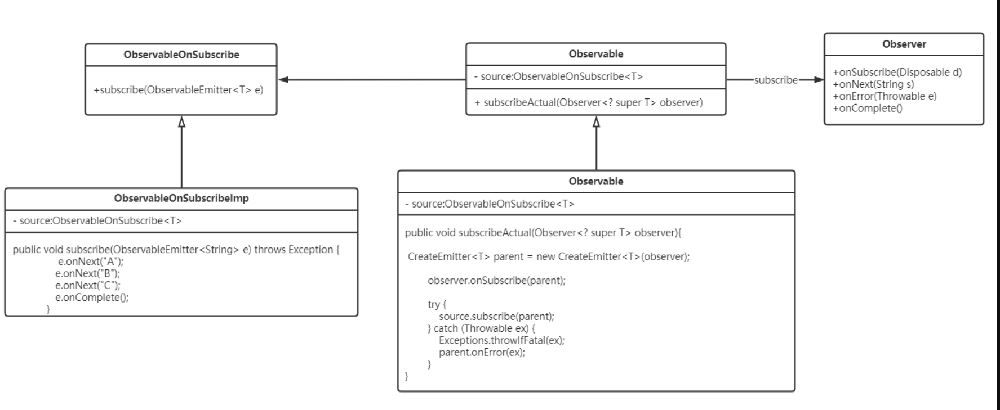

# 1.背景
RxJava 是Reactive Extensions的 Java VM 实现：一个使用可观察序列组成异步和基于事件的程序的库。

它扩展了观察者模式以支持数据/事件序列，并添加了允许您以声明方式组合序列的运算符，同时抽象出对低级线程、同步、线程安全和并发数据结构等事物的关注。
# 2.作用
基本作用就是使用观察者模式实现异步操作。

# 3.原理


# 3.使用

基本操作就是：

1）创建被观察者。

2）创建观察者。

3）使用subscribe把观察者和被观察者关联。



### （1）依赖RxJava

```
//RxAndroid中包含RxJava的内容，只引入RxAndroid还是会报错
dependencies {
    ......
    compile 'io.reactivex.rxjava2:rxjava:2.1.3'
    compile 'io.reactivex.rxjava2:rxandroid:2.0.1'
```
### （2）创建被观察者

RxJava 提供了很多方法，创建被观察者对象Observable

RxJava1.x中，Observeable用于订阅Observer和Subscriber。

RxJava2.x中， Observeable用于订阅Observer ，是不支持背压的，而 Flowable用于订阅Subscriber ，是支持背压(Backpressure)的。

如下例子：

```
    //方法一：create
    private Observable Observable1(){
        return Observable.create(new ObservableOnSubscribe<String>() {
            @Override
            public void subscribe(ObservableEmitter<String> emitter) throws Exception {
                // 通过 ObservableEmitter类对象产生事件并通知观察者
                // ObservableEmitter：定义需要发送的事件 & 向观察者发送事件
                emitter.onNext("create-1");
                emitter.onNext("create-2");
                emitter.onNext("create-3");
                emitter.onComplete();
            }
        });
    }
    //方法二：just
    private Observable Observable2(){
        return Observable.just("just-1","just-2","just-3");
    }
    //方法三：fromArray
    private Observable Observable3(){
        String[] words = {"fromArray-1","fromArray-2","fromArray-3"};
        return Observable.fromArray(words);
    }
    private Observable Observable4(){
        int i = 0;
        Observable observable = Observable.interval(1, TimeUnit.SECONDS)
                .map(new Function<Long, String>() {
                    //注意： new Function<Long, String>第一个指定的是apply()的参数类型，第二个指定的是apply()的返回类型
                    @Override
                    public String apply(Long aLong) throws Exception {
                        return "interval-"+aLong.toString();
                    }
                });
        return observable;
    }

    private Flowable Observable5(){
        Flowable observable = Flowable.create(new FlowableOnSubscribe<String>() {
            @Override
            public void subscribe(FlowableEmitter<String> emitter) throws Exception {
                emitter.onNext("create-1");
                emitter.onNext("create-2");
                emitter.onNext("create-3");
                emitter.onComplete();
            }
        }, BackpressureStrategy.BUFFER)
                .subscribeOn(Schedulers.io())
                .observeOn(AndroidSchedulers.mainThread());
        return observable;
    }
```


### （3）创建观察者

RxJava1.x中，Observeable用于订阅Observer和Subscriber。

RxJava2.x中， Observeable用于订阅Observer ，是不支持背压的，而 Flowable用于订阅Subscriber ，是支持背压(Backpressure)的。


例子如下：

```
    private Subscriber createObserver1(){
        return new Subscriber<String>() {
            @Override
            public void onSubscribe(Subscription s) {
                s.request(10);
                Log.d(TAG,"Subscriber-onSubscribe");
            }

            @Override
            public void onNext(String o) {
                Log.d(TAG,"Subscriber-onNext: "+ o);
            }

            @Override
            public void onError(Throwable t) {
                Log.d(TAG,"Subscriber-onError"+t.getMessage());
            }

            @Override
            public void onComplete() {
                Log.d(TAG,"Subscriber-onComplete");
            }
        };
    }

    private Observer createObserver2(){
        return new Observer<String>() {
            @Override
            public void onSubscribe(Disposable d) {
                Log.d(TAG,"onNext: "+ d.isDisposed());
            }

            @Override
            public void onNext(String o) {
                Log.d(TAG,"onNext: "+ o);
            }

            @Override
            public void onError(Throwable t) {

            }

            @Override
            public void onComplete() {
                Log.d(TAG,"onComplete: ");
            }
        };
    }
```

onCompleted()  —— 表示事件队列完结的回调。RxJava规定，当不会再有新的 onNext() 发出
                                   时，需要触发onCompleted() 方法作为标志。
								   
onError()           —— 表示事件队列异常。事件处理过程中如果发生异常，就被触发onError()，同
                                   时事件队列自动终止，不允许再有事件发出。
								   
注意： 在一个正确运行的事件序列中， onCompleted() 和  onError() 有且只有一个会触发，两者是互斥的，并且是事件序列的最后一个事件

### （4）使用subscribe把观察者和被观察者关联

RxJava1.x中，Observeable用于订阅Observer和Subscriber。

RxJava2.x中， Observeable用于订阅Observer ，是不支持背压的，而 Flowable用于订阅Subscriber ，是支持背压(Backpressure)的。

```
 //Observable4返回的是Observeable，createObserver2返回的是Observer
 Observable4().subscribe(createObserver2());
 
 //Observable5返回的是Flowable，createObserver1返回的是Subscriber
Observable5().subscribe(createObserver1());
```

# 4.操作符

### （1）创建操作符

创建被观察者（Observable）对象&发送事件


### （2）转换操作符
### 
变换被观察者(Observable)发送的事件。将Observable发送的数据按照一定的规则做一些变换，然后再将变换的数据发射出去。

### （3）合并操作符
组合多个被观察者(Observable)&合并需要发送的事件。


### （4）功能操作符
辅助被观察者(Observable) 发送事件时实现一些功能性需求，如错误处理，线程调度


### （5）过滤操作符
用于将Observable发送的数据进行过滤和选择。让Observable返回我们所需要的数据。


# 5.常用操作
### （1）串行执行
使用contact或contactArray来实现.

contact和contactArray的区别是：
***
contact最多只能执行三个串行任务，而contactArray可以执行多个，并且contactArray是可以直接传入数组的
***

例子：
```
    private Observable testSerial(){
        return Observable.concat(thread1(),thread2(),thread3())
                .subscribeOn(Schedulers.io())
                .observeOn(AndroidSchedulers.mainThread());
    }

    private Observable thread1(){
        return Observable.create(new ObservableOnSubscribe<String>() {
            @Override
            public void subscribe(ObservableEmitter<String> e) throws Exception {
                new Thread(new Runnable() {
                    @Override
                    public void run() {
                        for (int i = 0;i<5;i++) {
                            Log.e(TAG,"Thread1:"+i);
                            e.onNext("Thread1:"+i);
                        }
                        e.onComplete();
                    }
                }).start();
            }
        });

    }
    private Observable thread2(){
        return Observable.create(new ObservableOnSubscribe<String>() {
            @Override
            public void subscribe(ObservableEmitter<String> e) throws Exception {
                new Thread(new Runnable() {
                    @Override
                    public void run() {
                        for (int i = 0;i<5;i++) {
                            Log.e(TAG,"Thread2:"+i);
                            e.onNext("Thread2:"+i);
                        }
                        e.onComplete();
                    }
                }).start();
            }
        });

    }
    private Observable thread3(){
        return Observable.create(new ObservableOnSubscribe<String>() {
            @Override
            public void subscribe(ObservableEmitter<String> e) throws Exception {
                new Thread(new Runnable() {
                    @Override
                    public void run() {
                        for (int i = 0;i<5;i++) {
                            Log.e(TAG," Thread3:"+i);
                            e.onNext("Thread3:"+i);
                        }
                        e.onComplete();
                    }
                }).start();
            }
        });

    }
```

### （2）串行传值

```
    private  void testSerialWithData(){
        Observable.create(new ObservableOnSubscribe<Map<String,String>>() {
                    @Override
                    public void subscribe(ObservableEmitter<Map<String,String>> e) throws Exception {
                        //onNext里的参数要和ObservableEmitter<Map<String,String>>以及ObservableOnSubscribe<Map<String,String>>匹配上，否则会报错
                        Map<String,String> map = new HashMap<>();
                        map.put("request1",request1());
                        Log.e(TAG,"request1:"+map.toString());
                        e.onNext(map);
                        e.onComplete();
                    }
                })
                .map(new Function<Map<String,String>, Map<String,String>>() {
                    @Override
                    public Map<String,String> apply(Map<String,String> s) throws Exception {
                        Log.e(TAG,"request2:"+s.toString());
                        s.put("request2",request2());
                        return s;
                    }
                })
                .map(new Function<Map<String,String>, Map<String,String>>() {
                    @Override
                    public Map<String,String> apply(Map<String,String> s) throws Exception {
                        Log.e(TAG,"request3:"+s.toString());
                        s.put("request3",request3());
                        return s;
                    }
                })
                .subscribeOn(Schedulers.io())
                .observeOn(AndroidSchedulers.mainThread())
                .subscribe(new Observer<Map<String, String>>() {
                    @Override
                    public void onSubscribe(Disposable d) {

                    }

                    @Override
                    public void onNext(Map<String, String> stringStringMap) {
                        Log.e(TAG,"request:"+stringStringMap.toString());
                    }

                    @Override
                    public void onError(Throwable e) {
                        Log.e(TAG,"request-onError:"+e.getMessage());
                    }

                    @Override
                    public void onComplete() {
                        Log.e(TAG,"request-onComplete:");
                    }
                });
    }
    private String request1(){
        try {
            Thread.sleep(2000);
        } catch (InterruptedException e) {
            e.printStackTrace();
        }
        return "request1";
    }
    private String request2(){
        try {
            Thread.sleep(2000);
        } catch (InterruptedException e) {
            e.printStackTrace();
        }
        return "request2";
    }
    private String request3(){
        try {
            Thread.sleep(2000);
        } catch (InterruptedException e) {
            e.printStackTrace();
        }
        return "request3";
    }
```

# 6.测试源码
[测试源码](https://github.com/lgygg/TestRxJava)